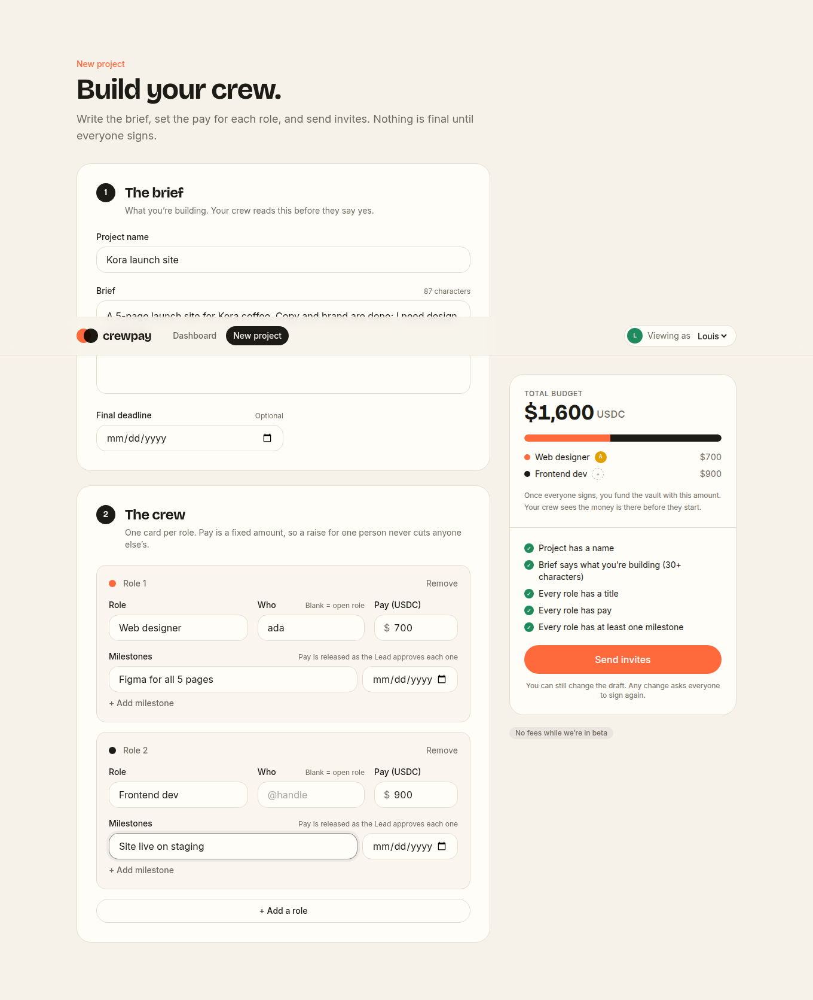
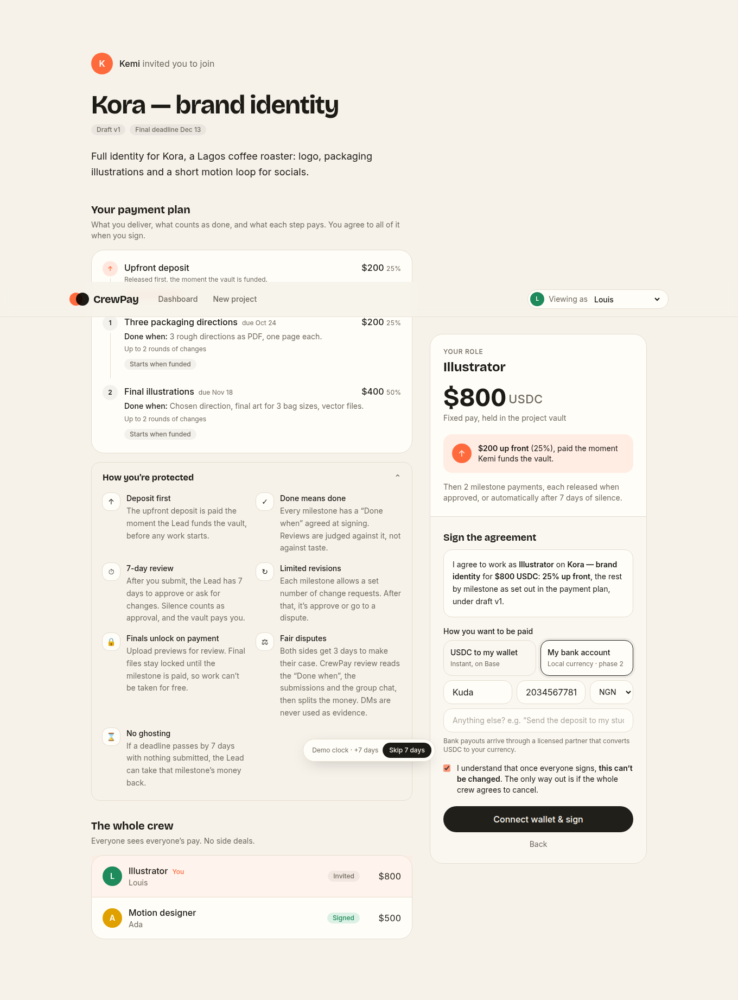
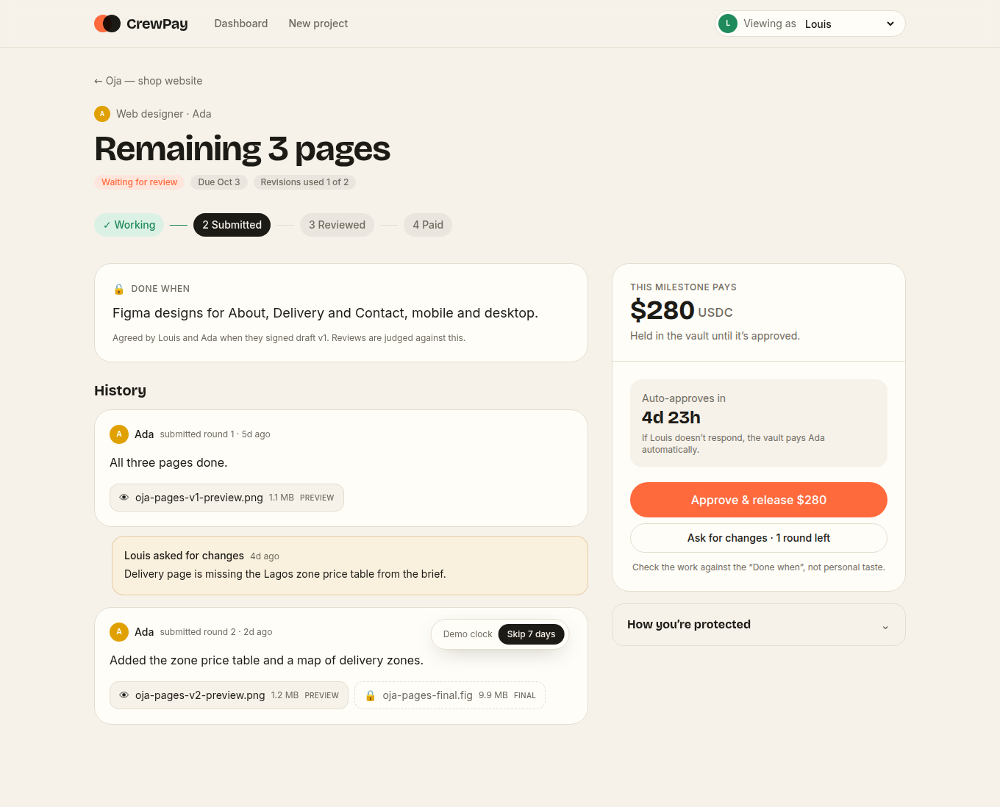
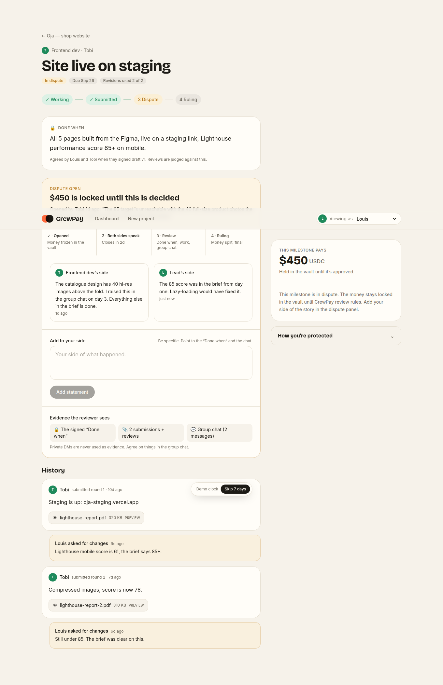

# CrewPay

**Build your crew, agree on pay, get paid.**

CrewPay is for any group that works together and gets paid together: freelance teams, music collabs, design duos, small shops. The Lead writes the brief and sets each role's pay, upfront deposit and milestones. Collaborators accept, counter-offer (on pay and deposit), or decline, and say how they want to be paid. Nothing is final until everyone signs. Then the Lead funds a vault on Base: deposits go out first, and the rest is paid milestone by milestone.

This repo is the **front-end prototype**. Wallets, the vault and the database are mocked, so the whole flow can be clicked through today.

| Create project | Review & sign |
| --- | --- |
|  |  |
| **Milestone review** | **Dispute** |
|  |  |

## Run it on your computer

You need [Git](https://git-scm.com/downloads), [Node.js](https://nodejs.org) (the LTS version) and an editor such as [VS Code](https://code.visualstudio.com).

```bash
git clone https://github.com/louis-d-great/PayClaw.git
cd PayClaw
npm install
npm run dev
```

Open the address it prints (usually http://localhost:5173). To get the latest changes later: `git pull`, then `npm install`.

Use **Viewing as** in the top bar to switch between Louis, Tobi, Ada, Kemi and **CrewPay review** (the dispute reviewer). **Skip 7 days** at the bottom moves the clock forward so you can watch auto-approval fire. **Reset demo data** on the dashboard restores the sample projects.

## Try this flow

1. As **Louis**, open *Oja — shop website*. The vault shows what's been paid, and "Needs you" lists what's waiting on you.
2. Open **Remaining 3 pages**: ask for changes (the last round), switch to **Ada** and resubmit, then back as Louis approve it. The vault pays her.
3. Open **Site live on staging**: it's in dispute. Add Louis's side, then switch to **CrewPay review** and issue a ruling that splits the money.
4. Open **Copy for all 5 pages**: the deadline passed with nothing submitted, so Louis can reclaim it.
5. As **Tobi**, submit **Launch + handover**, then press **Skip 7 days**. It auto-approves and pays.
6. As Louis, open *Lagos Nights EP* and accept Ada's counter-offer ($550, 30% up front). Everyone has to sign again.

7. **Chat:** in any project, reply to a message, attach a photo or file, or record a voice note (🎙). The tabs above the chat switch between the group chat and a private DM with each member.
8. **Open roles:** as **Tobi**, open the Mix engineer invite on *Lagos Nights EP* and apply with a portfolio link. Back as Louis, pick an applicant.
9. **Edit or cancel:** before funding, the Lead can **Edit draft** (everyone re-signs) or cancel. After funding, **Cancel the project** needs everyone to agree.
10. **Profiles:** click anyone's name, or **Profile** in the top bar, to see their track record and work receipts.

## Milestone rules

| Rule | What happens |
| --- | --- |
| Deposit first | Each role's upfront deposit is paid the moment the vault is funded. |
| Done when | Every milestone has a definition of done, signed by both sides. Reviews are judged against it. |
| 7-day review | Lead silent for 7 days after a submission means it auto-approves and pays. |
| Limited revisions | Each milestone allows N change requests (default 2). After that: approve, or open a dispute. |
| Finals unlock on payment | Previews are open, final files stay locked until the milestone is paid. |
| Disputes | Both sides state their case for 3 days. CrewPay review reads the "Done when", submissions and group chat (never DMs), then splits the money. Final. |
| No ghosting | A deadline passed by 7 days with nothing submitted lets the Lead reclaim that milestone's money. |

All of these live in `src/lib/rules.ts`, which is what the vault contract will enforce.

## What's real and what's mocked

| Piece | Now | Next |
| --- | --- | --- |
| Screens, flow, rules (signing, versions, counter-offers) | Real | — |
| Accounts | "Viewing as" switcher | Sign-in + Coinbase Smart Wallet |
| Storage, chat, DMs, profiles | `localStorage` (small files kept inline) | Supabase: schema and security rules ready on the `claude/backend-setup` branch |
| Signatures | Button | EIP-712 signature over (project, version, role, pay) |
| Vault + payouts | Simulated ledger | Solidity escrow on Base: deposits, milestone release, auto-approve, rulings |
| Files | Names only | Supabase Storage, finals locked until paid |
| Bank payouts | Saved preference | Offramp partner (phase 2) |

## Rules the code enforces

- Every change to the draft bumps its **version**. A signature only counts for the version it was made on, so any change asks everyone to sign again (`src/store.tsx`).
- Pay is a **fixed amount per role**. A raise comes out of the Lead's budget, not a teammate's pay.
- Everyone sees everyone's pay.
- The project can only be funded once every role is signed.

## Stack

React 19 · TypeScript · Tailwind CSS v4 · Vite · React Router

## Project map

```
src/
  types.ts               Project, Role, Milestone, Message
  store.tsx              State, actions, demo data (swap for Supabase later)
  pages/CreateProject    Screen 1: brief, roles, pay, milestones
  pages/ReviewAndSign    Screen 2: accept, counter-offer, decline, sign
  lib/rules.ts           Deposit, milestone, review, dispute and reclaim rules
  pages/ProjectPage      Signatures, invite links, funding, vault, work, chat
  pages/MilestonePage    Submit, review, revisions, dispute and ruling
  pages/ProfilePage      Track record and work history
  pages/ReceiptPage      Public work receipt for a project
  components/Chat        Group chat + DMs: replies, files, voice notes, seen ticks
  lib/reputation.ts      Track record computed from signed work and payouts
  pages/Dashboard        Projects I lead / Projects I'm on
```
